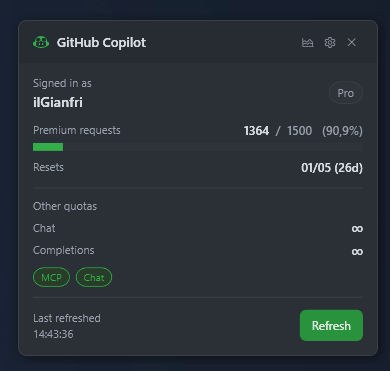

# copilot-tray-stats

[](https://github.com/ilGianfri/copilot-tray-stats/actions/workflows/release.yml)

<p align="center">
  
</p>

A Windows system-tray app that shows your GitHub Copilot premium request quota at a glance. It polls the GitHub Copilot API on a configurable interval and reflects your remaining requests through a color-coded tray icon.

## Features

- Tray icon changes color based on quota remaining (green / amber / red)
- Popup window with remaining requests, reset date, Chat and Completions status
- **Daily usage history** — bar chart of requests used per day since the last quota reset, shown as a slide-out panel inside the popup
- Configurable refresh interval and run-on-startup via built-in settings
- Last-known quota is restored immediately on launch (no blank state)
- Tooltip shows a compact summary without opening the popup

## Prerequisites

- [.NET 10 SDK](https://dotnet.microsoft.com/download)
- [GitHub CLI](https://cli.github.com/) installed and authenticated

```
gh auth login
```

## Build & Run

```powershell
dotnet build CopilotTrayStats.csproj
dotnet run --project CopilotTrayStats.csproj
```

## Usage

After launching, the app lives in the system tray. Click the icon to open the popup. Right-click for a context menu with Refresh and Exit options.

The popup title bar has three buttons:

| Button | Action |
|--------|--------|
| 📊 chart icon | Toggle the daily usage history panel |
| ⚙ gear icon | Open settings |
| ✕ | Close the popup |

The **settings window** lets you configure:

- **Run on startup** — registers the app in `HKCU\...\Run`
- **Refresh interval** — 1 minute to 1 hour

The **usage history panel** slides in to the left of the popup and shows one bar per day since the last quota reset. The bar height is proportional to requests used that day; today's bar is highlighted. Data is recorded automatically on every successful API refresh and persisted to `%AppData%\CopilotTrayStats\history.json`.

## Architecture

```
App.xaml.cs
  GitHubAuthService        shells out to `gh auth token`
  CopilotApiService        GET https://api.github.com/copilot_internal/user
  SettingsService          JSON in %AppData%\CopilotTrayStats\settings.json
                           + state.json (last-known quota snapshot)
  UsageHistoryService      JSON in %AppData%\CopilotTrayStats\history.json
  MainViewModel            observable state, PeriodicTimer refresh
  SettingsViewModel        refresh interval + Windows startup registry
  UsageHistoryViewModel    daily delta computation + bar chart data
  MainWindow               popup window (inline history panel)
  TaskbarIcon              H.NotifyIcon.Wpf
```

No dependency injection container — `App.xaml.cs` constructs and wires all services.

## Stack

| Component | Library |
|-----------|---------|
| UI framework | WPF (.NET 10) |
| MVVM | CommunityToolkit.Mvvm 8.4.0 |
| Tray icon | H.NotifyIcon.Wpf 2.1.3 |
| Auth | GitHub CLI (`gh auth token`) |

## Notes

- The API endpoint (`copilot_internal/user`) is undocumented and may change without notice.
- The tray icon is rendered from the GitHub Copilot SVG path at runtime — no icon file is required.
- Clicking the Copilot icon in the popup title bar five times toggles a raw API response panel for debugging.
